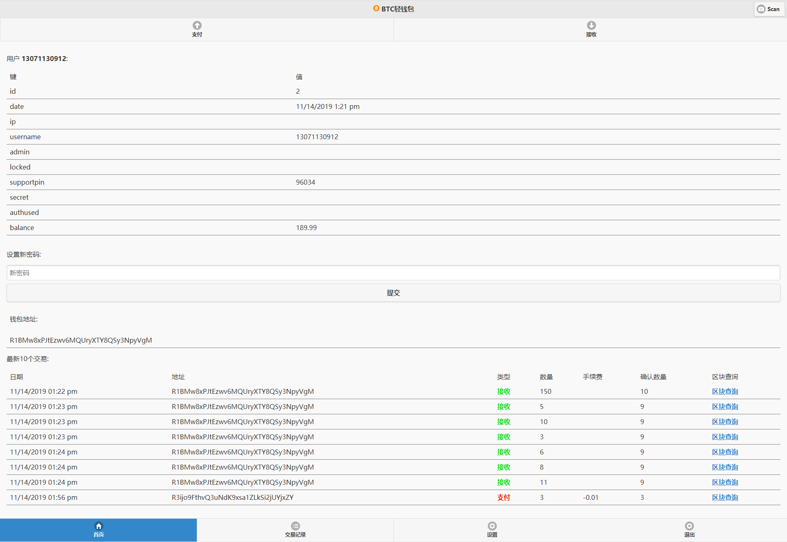
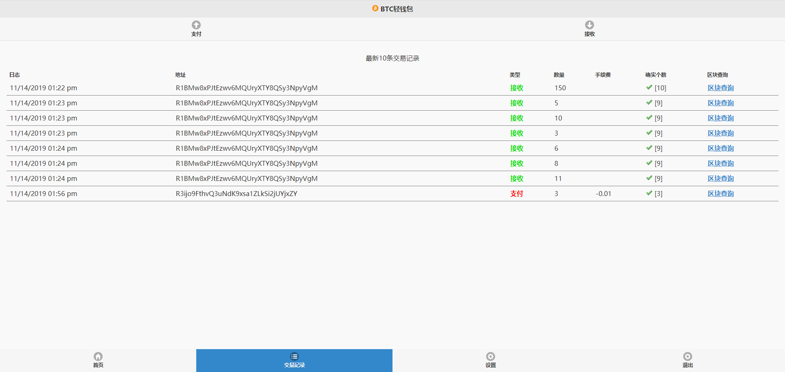

# 数字资产钱包 区块链钱包 单币种钱包 APP在线钱包 手机版钱包

测试账号：13071130912 密码 Aa000000

Ver 1.09 版本升级日志
1：全站ui用到的js以及css做了优化精简，系统更流畅。

2：针对BTC，USDT以及山寨币接口简易部署，方便。

3：增强兼容性。

4：完美运营版。

移动新轻钱包功能：
1：币种算法，SHA-256。
2:   证明方式： PoW
3:   钱包支付转账。
4:   钱包接收。
5:   钱包地址以及二维码的生成。
6:   钱包交易明细查询。
7： 后台管理，锁定账户，删除账户。
8： 钱包总额查询。
9： 账户注册，登陆，修改。
11：ajax缓存技术。

## Screenshots

# 声明

1. 使用本系统方必须在国家相关法律法规范围内并经过国家相关部门的授权许可，禁止用于一切非法行为。

2. 本系统限于测试、实验、研究为目的，禁止用于一切商业运营，本团队不承担使用者在使用过程中的任何违法行为负责。

3. 源码以演示站为准。

